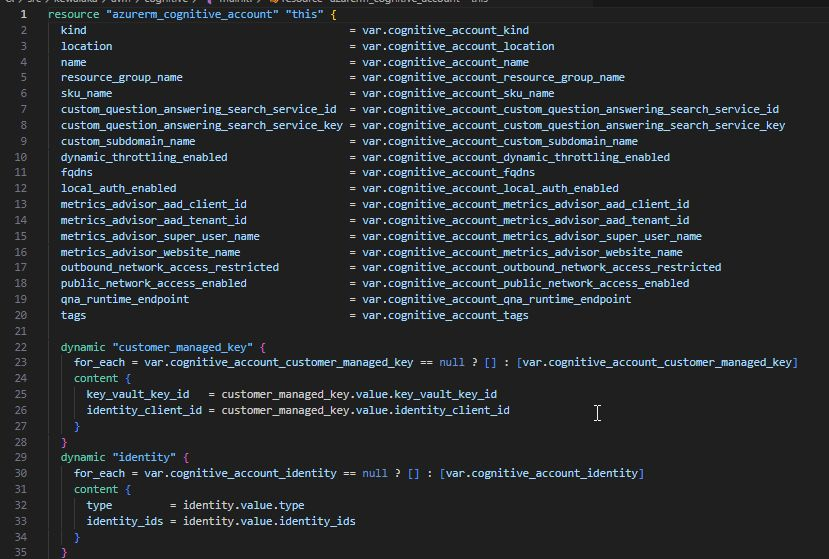

```newres``` is a command line utility that helps you write Terraform modules faster. It supports multiple cloud providers (e.g. azure, aws, gcp), and several other providers too (e.g. kubernetes & tls).

## Usage

To use, is as easy as:

```pwsh
newres -dir [DIRECTORY] [-u] [-r RESOURCE_TYPE]
```

...e.g. for an Azure Resource Group:

```pwsh
newres -dir ./ -r azurerm_resource_group
```

This will create the 'main.tf' and 'variables.tf' covering the arguments from the schema documentation. The example screenshot below shows the start of main.tf for a cognitive services account resource, illustrating the coverage and the use of dynamics for optional blocks.



The tool can be run multiple times in the same directory, allowing you to continue to add more resource types to the main.tf & variables.tf files.

### Unified variable option

The 'unified' variable flag ('-u') is particularly useful for writing the variable definitions for child resources in modules, such as the database resource in a sql server module.

## Availability & instructions

More details, including installation instructions, available on the [official github site](https://github.com/lonegunmanb/newres).
