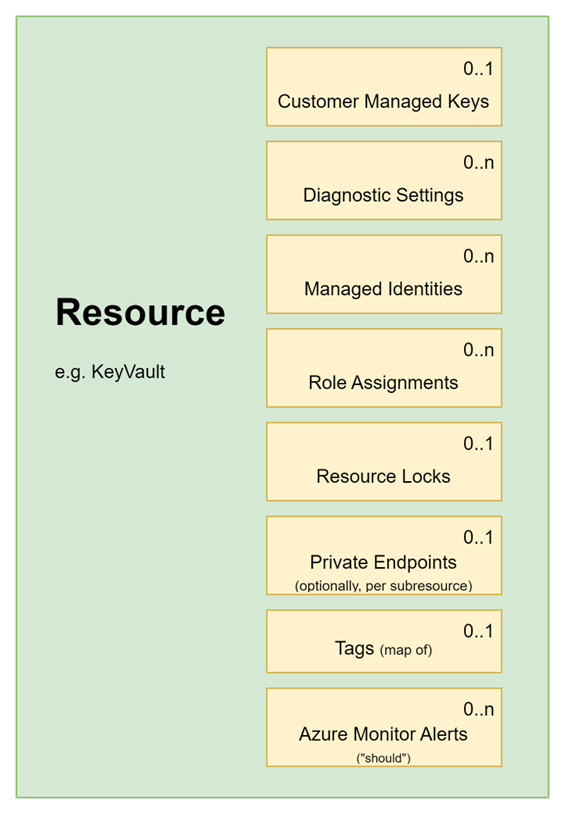
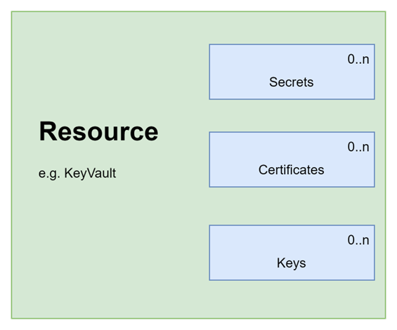
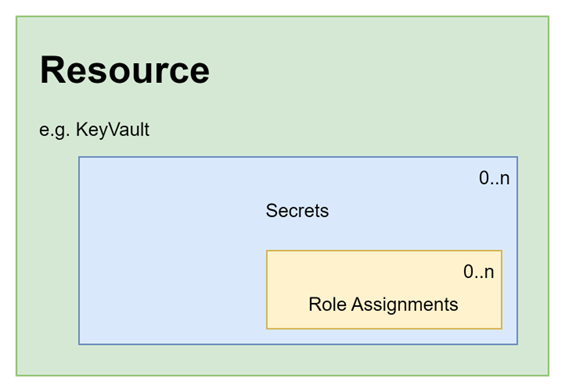

Regardless of whether you are writing AVM modules, or simply using them, it is useful to understand the "shared interfaces", as described on the [AVM website](<https://azure.github.io/Azure-Verified-Modules/specs/shared/interfaces/>).

Each module must implement the following interfaces if they are supported by the underlying resource:



What does this mean as a module consumer?  It means there should be a module input available for each of these:

```terraform
module "keyvault" {
  source                        = "Azure/avm-res-keyvault-vault/azurerm"
  version                       = "0.5.1"
  name                          = module.naming.key_vault.name_unique
  location                      = azurerm_resource_group.this.location
  resource_group_name           = azurerm_resource_group.this.name
  tenant_id                     = data.azurerm_client_config.this.tenant_id
  sku_name                      = "standard"

  role_assignments = {
    # define the role assignments
  }
  secrets = {
    # define the secrets
  }
  private_endpoints = {
    # define the private endpoints
  }
  diagnostic_settings = {
    # define the diagnostic settings
  }
  // etc
  tags = var.tags
}

```

Whether you use them, is optional.  Lets dive into some examples!

## Role Assignments example

We'll make a couple role assignments for a Key Vault, one for a pretend app, and another for the principal running the devops pipeline (say, to let the pipeline update secrets).

Here's how you might be tempted to write this:

```terraform
module "keyvault" {
  source                   = "Azure/avm-res-keyvault-vault/azurerm"
  version                  = "0.5.1"
  name                     = local.keyvault_name
  enable_telemetry         = false
  resource_group_name      = data.azurerm_resource_group.parent.name
  location                 = local.location
  tenant_id                = data.azurerm_client_config.this.tenant_id
  purge_protection_enabled = false
  sku_name                 = "standard"
  tags                     = var.tags
}

resource "azurerm_role_assignment" "my_app_secrets_user" {
  scope                = module.keyvault.resource.id
  role_definition_name = "Key Vault Secrets User"
  principal_id         = "a2b9c8d7-1e3f-42c5-b6a7-c8e9l0d1e2a3" # this is a made up ID! 
}

resource "azurerm_role_assignment" "devops_principal_secrets_officer" {
  scope                = module.keyvault.resource.id
  role_definition_name = "Key Vault Secrets Officer"
  principal_id         = data.azurerm_client_config.example.object_id  
}
```

### AVM: Key vault role assignment

This is perfectly valid, and it will work, but in AVM you can provide the role assignment directly to the module, like this:

```terraform
module "keyvault" {
  source                   = "Azure/avm-res-keyvault-vault/azurerm"
  version                  = "0.5.1"
  name                     = local.keyvault_name
  resource_group_name      = data.azurerm_resource_group.parent.name
  location                 = local.location
  tenant_id                = data.azurerm_client_config.this.tenant_id
  purge_protection_enabled = false
  sku_name                 = "standard"
  tags                     = var.tags

  role_assignments = {
    my_app_secrets_user = {
      role_definition_id_or_name = "Key Vault Secrets User"
      principal_id               = "a2b9c8d7-1e3f-42c5-d6i7-c8k9l0a1b2e3" # this is a made up ID!
    },
    devops_principal_secrets_officer = {
      role_definition_id_or_name = "Key Vault Secrets Officer"
      principal_id               = data.azurerm_client_config.this.object_id  
    },
  }
}
```

The name of the keys ("my_app_secrets_user" and "devops_principal_secrets_officer") is arbitrary but should be statically named.  This relates to the correct use of "for each", which is explained in [this video from Matt White's YouTube channel](https://www.youtube.com/watch?v=Q4ANHRUsVKA).

## Private endpoint example

The way to specify a private endpoint is similar, you can see it in full in one of the end-to-end tests in the [official KeyVault repository](https://github.com/Azure/terraform-azurerm-avm-res-keyvault-vault/tree/main/examples/private-endpoint).

Here is the relevant snippet for illustration:

```terraform
module "keyvault" {
  source                        = "Azure/avm-res-keyvault-vault/azurerm"
  version                       = "0.5.1"
  name                          = module.naming.key_vault.name_unique
  location                      = azurerm_resource_group.this.location
  resource_group_name           = azurerm_resource_group.this.name
  tenant_id                     = data.azurerm_client_config.this.tenant_id
  public_network_access_enabled = false

  private_endpoints = {
    primary = {
      private_dns_zone_resource_ids = [azurerm_private_dns_zone.this.id]
      subnet_resource_id            = azurerm_subnet.this.id
    }
  }
}
```

The important point, is the **same interface is shared between resources**, which means if you know how to add a role assignment or a private endpoint to a Key Vault, it is the same for a Storage Account, Database etc.

## Wait, this looks like CARML?

Seasoned followers of the Bicep will likely recognise this approach from the [CARML library](https://github.com/Azure/ResourceModules)

That is no accident!  AVM seeks to align the experience between Bicep and Terraform resource modules, whilst acknowledging recommended practices from each language.

## Child resources

The scoping of child resources with the parent module is another example where the Terraform and Bicep approach is united.  Below illustrates what the looks like for Key Vault:



### AVM: create a secret

As an example, secrets can be defined like this (line 29 onwards):

```terraform
data "http" "my_ip" {
  url = "https://ifconfig.me/ip"
}

module "keyvault" {
  source                        = "Azure/avm-res-keyvault-vault/azurerm"
  version                       = "0.5.1"
  name                          = module.naming.key_vault.name_unique
  enable_telemetry              = var.enable_telemetry
  location                      = azurerm_resource_group.this.location
  resource_group_name           = azurerm_resource_group.this.name
  tenant_id                     = data.azurerm_client_config.this.tenant_id
  purge_protection_enabled      = false
  public_network_access_enabled = true # so we can check the secrets get created ok.
  sku_name                      = "standard"
  tags                          = var.tags

  network_acls = {
    ip_rules = [data.http.my_ip.response_body]
  }

  role_assignments = {
    devops_principal_secrets_officer = {
      role_definition_id_or_name = "Key Vault Secrets Officer"
      principal_id               = data.azurerm_client_config.this.object_id
    },
  }

  secrets = {
    "my_first_secret" = {
      name = "my-1st-secret" # name only supports alphanumeric & dashes
    }
  }

  # secret values are marked as sensitive and thus can not be used in a for_each loop
  secrets_value = {
    "my_first_secret"  = random_password.second_secret.result,
  }
}

```

A few things to call out in the above:

* Secrets are specified as a map supplied to the ``secrets`` variable.  A separate variable is used for ``secrets_value`` because it is marked as sensitive and therefore cannot be used in a "for_each" loop.  
* The map key (e.g. "my_first_secret") needs to match between the secret & the secret_value.

Since RBAC & the firewall is enabled, I'm creating a role for the pipeline to be able to create the secret, and updating the IP restrictions based on the runner's IP.  In an enterprise, this would typically be done using a self-hosted runner.

Here's a more complex block that illustrates AVM support for all secret parameters:

```terraform
  secrets = {
    "my_first_secret" = {
      name = "my-1st-secret"
    }
    "my_second_secret" = {
      name = "my-2nd-secret"
      # optional parameters
      description     = "this is a very important secret that does important things"
      content_type    = "text/plain"
      expiration_date = "2024-08-01T00:00:00Z"
      not_before_date = "2024-01-01T14:30:00+12:00" # 14:30 on 1st Jan 2024 UTC+12
      tags = merge(var.tags, {
        my_extra_tag_for_secret = "top secret"
      })
    }
  }

  secrets_value = {
    "my_first_secret"  = random_password.second_secret.result,
    "my_second_secret" = random_password.second_secret.result
  }
```

## Role assignments for child resources

The pattern for shared interfaces continues down to child resource - again AVM specifies that child resources must implement the shared interfaces if they are supported by the resource.  Here's a picture to explain:



### AVM: secrets with role assignments

Here is the secret block showing a role assignment against an individual secret:

```terraform
  secrets = {
    "my_first_secret" = {
      name = "my-1st-secret"
    }
    "my_second_secret" = {
      name = "my-2nd-secret"
      # illustrating a role assignment for a specific secret
      role_assignments = {
        my_test_group = {
          role_definition_id_or_name = "Key Vault Secrets User"
          # make sure you use a principal that exists in Entra ID!
          principal_id               = "8391afd1-838e-8097-aefd-6e6e9841959f" 
        }
      }
    }
  }

  # secret values are marked as sensitive and thus can not be used in a for_each loop
  secrets_value = {
    "my_first_secret"  = random_password.second_secret.result,
    "my_second_secret" = random_password.second_secret.result
  }
```

This same approach is repeated for other resources, for instance creating role assignments against a storage container.

## Find the code on GitHub

You can find the role assignment & secret examples on my GitHub:

<https://github.com/kewalaka/terraform-avm-keyvault-examples>

Examples for Private endpoint & diagnostic settings are available in the end to end tests for the KeyVault Module:

<https://github.com/Azure/terraform-azurerm-avm-res-keyvault-vault/tree/main/examples>
