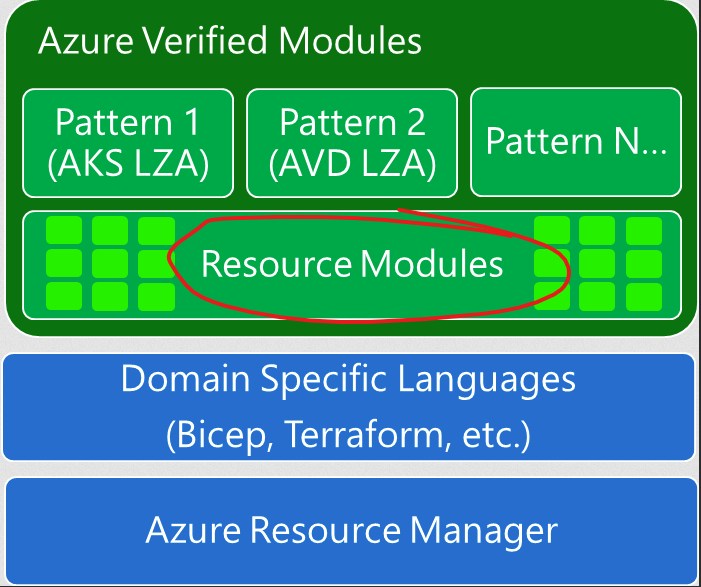
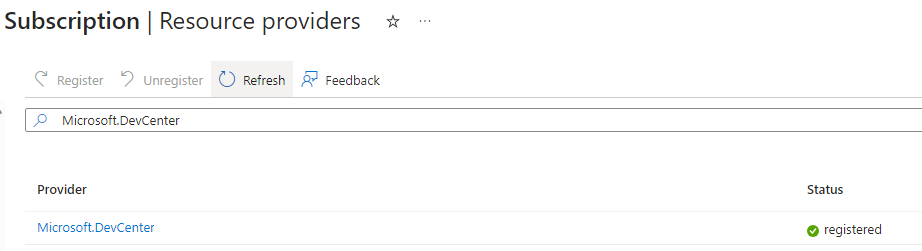
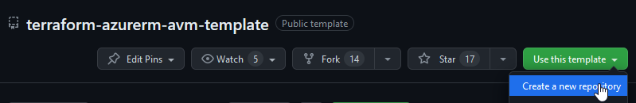
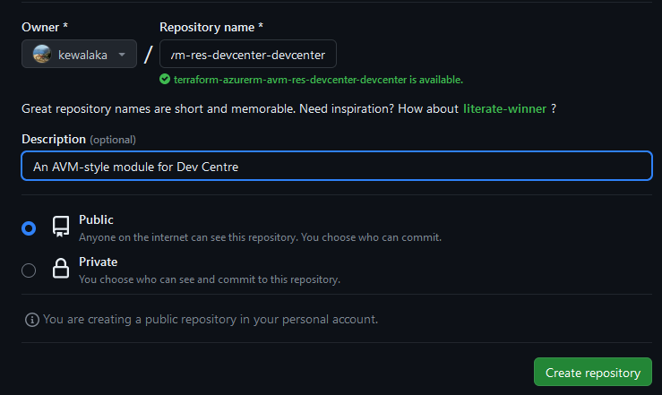
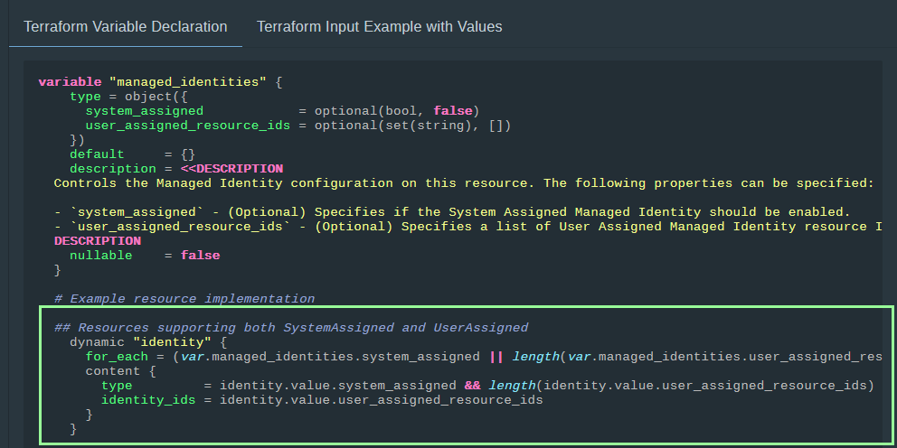
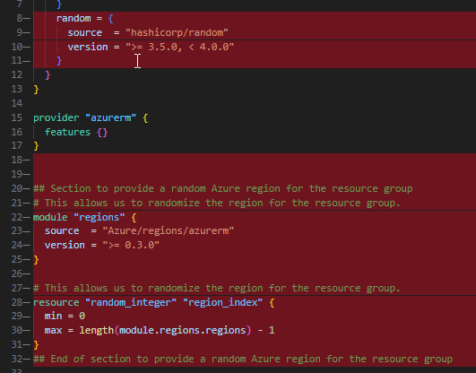
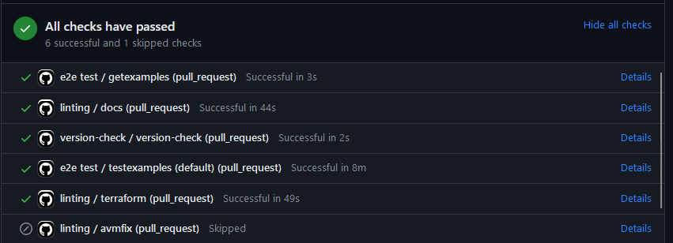

This is a post about writing your first [Azure Verified Modules](https://aka.ms/AVM), for those interested in the background about AVM, check out this recent [intro on YouTube](https://www.youtube.com/watch?v=JbIMrJKW5N0).

This is recommended as a learning exercise to familiarise yourself with AVM.  I strongly encourage contributing to the official resource modules Microsoft is in the process of building.

We're going to focus on writing a resource module:



It is recommended to use a unix-based system for writing AVM modules (e.g. either WSL2, a Mac, a Linux variant, or GitHub codespaces).

I assume a familiarity with git, including how to clone and create feature branches.

The process is going to be:

- Check if the AVM module already exists & understand resource module naming conventions.
- Create a new GitHub repo for the module from the AVM template.
- Update the GitHub repo to enable support for running 'end to end' tests in GitHub actions.
- Build the resource module, using the newres tool.

Let's get started!

## Check for an existing module

If a module already exists, we should use or contribute to the existing one.  They are all listed on the [AVM website](https://azure.github.io/Azure-Verified-Modules/indexes/terraform/tf-resource-modules/).

Bear in mind that many resources are not available yet, as this initiative is new.  We're going to pick "Dev Center" for this example, as it doesn't yet exist in AVM for Terraform.

## AVM Module naming

If you can't find the resource, lets make one!  We'll start by understanding the module naming conventions.

AVM modules are named as [per the spec](https://azure.github.io/Azure-Verified-Modules/specs/shared/#terraform-resource-module-naming), to summarise it should look something like this:

```text
avm-res-<resource provider>-<ARM resource type>
```

- The resource provider should not include the "Microsoft." part.
- The resource type should be in singular form.

Here are some examples to help:

```text
avm-res-containerregistry-registry
avm-res-storage-storageaccount
avm-res-keyvault-vault
```

The GitHub repo name is prefixed with ``terraform-azurerm-`` to allow it to be published correctly in the Hashicorp public registry.

So, for example, the KeyVault GitHub repository would be:

<https://github.com/Azure/terraform-azurerm-avm-res-keyvault-vault>

## Raise a module proposal

If you're planning to contribute back (I strongly encourage it!), it is a good idea to raise an issue, this will help validate the module naming & scope and start the process to find a Microsoft FTE to support the module.

You can raise a module proposal using this issue template: <https://aka.ms/AVM/ModuleProposal>.

## A practical example

Lets get started making the Dev Centre resource module in Terraform, this is co-incidentally something I need as a pre-requisite to building a [Dev Box](https://azure.microsoft.com/en-us/products/dev-box/) in the Azure.  The repo address for this will be:

<https://github.com/Azure/terraform-azurerm-avm-res-devcenter-devcenter>

It's *a very simple example* with a limited number of inputs, a good place to start!

We'll check the Hashicorp documentation to make sure there is support for it in the AzureRM Terraform provider, and here it is:

<https://registry.terraform.io/providers/hashicorp/azurerm/latest/docs/resources/dev_center>

Remember, if AzureRM isn't available, there's always AzAPI, but that is for another day.

You may need to register the "Microsoft.DevCenter" provider in your subscription resource providers if you are following along:



## Use the AVM template

There is a an [AVM module template repository](https://github.com/Azure/terraform-azurerm-avm-template) to help get you started.



The repo name will be ``terraform-azurerm-avm-res-devcenter-devcenter``:



## GitHub settings

(TODO link to another guide with more detail for peeps that need it)

Within your cloned repo on Github, do the following:

1. Set up a GitHub repo environment called `test`.
1. Configure environment protection rule to ensure that approval is required before deploying to this environment.
1. Create a user-assigned managed identity in your test subscription.
1. Create a role assignment for the managed identity on your test subscription, recommend providing this "Contributor" and "Role Based Access Control Administrator".
1. Configure federated identity credentials on the user assigned managed identity. Use the GitHub environment.
1. Set the following secrets on your GitHub environment:
   1. ``AZURE_TENANT_ID``
   1. ``AZURE_SUBSCRIPTION_ID`` - i.e. the subscription you will be using to deploy resources to test the module.
   1. ``AZURE_CLIENT_ID`` - i.e. the client id of the managed identity.

## Clone & feature branch

Clone down the repository and open it in your preferred editor (I use Visual Studio Code).

Create a new feature branch for the initial version updates.

## Install the "newres" command line utility

You can skip this step if you're using the AVM template's Codespace, as it is already installed.

[newres](https://github.com/lonegunmanb/newres/) will usually greatly speed up writing the resource module where there are a lot of parameters.  In this example, there are only a few and isn't really worth it, but we'll continue so you see the method.  

If you repeat this process with something with lots of parameters, like App Gateway, you'll quickly see the benefit!

Assuming you already have [golang installed](https://go.dev/doc/install), run:

```bash
go install github.com/lonegunmanb/newres/v3@latest
```

Run the following to make a temporary folder for newres output and run the tool:

```bash
mkdir newres
cd newres
newres -dir ./ -r azurerm_dev_center
```

If successful, you'll see:

```text
Successfully generated variables.tf and main.tf
```

The newres naming convention needs an adjustment for AVM, in the generate main.tf, observe the variables all start **dev_centre_** - we need to remove this prefix, leaving you with this:

```terraform
resource "azurerm_dev_center" "this" {
  location            = var.location
  name                = var.name
  resource_group_name = var.resource_group_name
  tags                = var.tags

  dynamic "identity" {
    for_each = var.identity == null ? [] : [var.identity]
    content {
      type         = identity.value.type
      identity_ids = identity.value.identity_ids
    }
  }
  dynamic "timeouts" {
    for_each = var.timeouts == null ? [] : [var.timeouts]
    content {
      create = timeouts.value.create
      delete = timeouts.value.delete
      read   = timeouts.value.read
      update = timeouts.value.update
    }
  }
}
```

This will also need to be fixed in the variables.tf file.

### newres updates for main.tf

Copy the contents of newres\main.tf into main.tf, replacing this block:

```terraform
resource "azurerm_TODO_the_resource_for_this_module" "this" {
}
```

Remove the TODO from the top of the file & update the location as follows:

```terraform
  location            = coalesce(var.location, local.resource_group_location)
```

Update the dynamic "identity" block (assuming it exists), following the reference examples in the [AVM interface specification for managed identities](https://azure.github.io/Azure-Verified-Modules/specs/shared/interfaces/#managed-identities):



```terraform
  dynamic "identity" {
    for_each = (var.managed_identities.system_assigned || length(var.managed_identities.user_assigned_resource_ids) > 0) ? { this = var.managed_identities } : {}
    content {
      type         = identity.value.system_assigned && length(identity.value.user_assigned_resource_ids) > 0 ? "SystemAssigned, UserAssigned" : length(identity.value.user_assigned_resource_ids) > 0 ? "UserAssigned" : "SystemAssigned"
      identity_ids = identity.value.user_assigned_resource_ids
    }
  }
```

Make sure you pick the correct one from the reference examples - the above is for resources that support both a SystemAssigned and UserAssigned identity, the specification has examples for other scenarios (e.g. SystemAssigned only).

### newres updates for variables.tf

Edit the contents of newres\variables.tf to remove the following variables:

- location
- name
- resource_group_name
- identity
- tags

(we're going to use the ones in the template, instead).

Copy the remaining variables to the top of ``variables.tf`` file in the module root folder
(in our case, there is only 'timeouts').

### newres tidy-up

Remove the newres folder.  By this point, any intellisense errors should be fixed in ``main.tf``, and the top of the main.tf should look something like this:

```terraform
data "azurerm_resource_group" "parent" {
  count = var.location == null ? 1 : 0
  name  = var.resource_group_name
}

resource "azurerm_dev_center" "this" {
  location            = coalesce(var.location, local.resource_group_location)
  name                = var.name
  resource_group_name = var.resource_group_name
  tags                = var.tags

  dynamic "identity" {
    for_each = (var.managed_identities.system_assigned || length(var.managed_identities.user_assigned_resource_ids) > 0) ? { this = var.managed_identities } : {}
    content {
      type         = identity.value.system_assigned && length(identity.value.user_assigned_resource_ids) > 0 ? "SystemAssigned, UserAssigned" : length(identity.value.user_assigned_resource_ids) > 0 ? "UserAssigned" : "SystemAssigned"
      identity_ids = identity.value.user_assigned_resource_ids
    }
  }

  dynamic "timeouts" {
    for_each = var.timeouts == null ? [] : [var.timeouts]
    content {
      create = timeouts.value.create
      delete = timeouts.value.delete
      read   = timeouts.value.read
      update = timeouts.value.update
    }
  }
}

# required AVM interfaces
# (etc)
```

## TODO hunting

There are a few "TODO" references in the files that need to be fixed and removed, ignore any that are in "README.md" because we'll fix those when we automatically update the docs.

### main.tf

- update ``azurerm_TODO_resource`` appropriately, e.g. ``azurerm_dev_center``

### locals.telemetry.tf

- set the module name and leave the module_type as "res", e.g.:

```terraform
  telem_puid = "UNOFFICIAL"
  module_name = "res-devcenter-devcenter"
  module_type = "res"
```

I suggest setting telem_puid to "UNOFFICIAL" on learning resources.

### main.privateendpoint.tf

- You would typically update  ``private_service_connection`` with the correct resource id and subresource name, something like this:

```terraform
private_service_connection {
    name                           = each.value.private_service_connection_name != null ? each.value.private_service_connection_name : "pse-${var.name}"
    private_connection_resource_id = azurerm_TODO.this.id
    is_manual_connection           = false
    subresource_names              = ["TODO subresource name"]
  }
```

*However*, in this case, Dev Center doesn't support private endpoints, so we're going to remove this file altogether.

There's a handy [link](https://learn.microsoft.com/en-us/azure/private-link/private-endpoint-overview#private-link-resource) in the template that helps find the right subresource name, should you need it for your resource.

### locals.tf

- We don't have any locals to add at the moment, so lets remove the reminder to "insert locals here"
- In this case, lets also remove the private endpoint local var, as we don't need private endpoints.

### terraform.tf

- remove the reminder to add required providers
- providers should really be versioned like this (correction to template needed):

```terraform
terraform {
  required_version = ">= 1.5.0"
  required_providers {
    azurerm = {
      source  = "hashicorp/azurerm"
      version = ">= 3.71.0, < 4.0"
    }
    random = {
      source  = "hashicorp/random"
      version = ">= 3.5.0, < 4.0"
    }
  }
}
```

### variables.tf

- In the ``name`` variable, update the regex in the validation condition.  If you're not sure how to do this, remove the validation block for now and we will return to it later.

- Since our resource doesn't support private endpoints, remove the "private_endpoints" variable.

- For an unofficial module, you might want to consider setting the default value of the ``enable_telemetry`` variable to ``false``.

### outputs.tf

- In this case, we don't need the output ``private_endpoints``.
- Remove the reminder ``TODO``
- Update the ``resource`` output value & add a couple mandatory outputs missing from the template:

```terraform
output "resource" {
  value       = azurerm_dev_center.this
  description = "This is the full output for the resource."
}

output "id" {
  description = "The ID of the resource."
  value       = azurerm_dev_center.this.id
}

output "name" {
  description = "The name of the resource"
  value       = azurerm_dev_center.this.id
}
```

### _header.md

- If you're using this for learning, remove the contents of this file and replace with something like this:

```terraform
# terraform-azurerm-res-devcenter-devcenter

This is a Terraform module for Azure Dev Center in the style of Azure Verified Modules.  For official modules please see <https://aka.ms/AVM>.

> [!WARNING]
> Major version Zero (0.y.z) is for initial development. Anything MAY change at any time. A module SHOULD NOT be considered stable till at least it is major version one (1.0.0) or greater. Changes will always be via new versions being published and no changes will be made to existing published versions. For more details please go to <https://semver.org/>
```

If this is not an official module, then I suggest removing the following files:

- ``SUPPORT.MD``
- ``SECURITY.MD``
- ``.github\CODEOWNERS``

## Creating the default example

Each of the ``.\examples`` folder of the module are run as part of the end to end tests during the the pull request workflow.

AVM modules start with a "default" example - the purpose of this is to test the module in its simplest form with the minimum number of parameters.

### Updates to the default example

In the default example, you may need to modify the resource group logic if you have policy that restricts where you can deploy locations:

```terraform
resource "azurerm_resource_group" "this" {
  name     = module.naming.resource_group.name_unique
  location = "AustraliaEast"
}
```

In this case, the resource is only supported in the following regions, so pick one of these:

- 'australiaeast,canadacentral,westeurope,japaneast,uksouth,eastus,eastus2,southcentralus,westus3,centralindia,eastasia,northeurope,koreacentral'

This also means we can remove the logic that randomly selects a region:



The module call if at the end of ``main.tf``, this would typically need adjustment to add the required variables, however in the case of Dev Center, just the name and resource group is enough:

```terraform
# This is the module call
# Do not specify location here due to the randomization above.
# Leaving location as `null` will cause the module to use the resource group location
# with a data source.
module "dev_center" {
  source = "../../"
  # source             = "Azure/avm-res-devcenter-devcenter/azurerm"
  # ...
  enable_telemetry    = var.enable_telemetry # see variables.tf
  name                = module.naming.dev_test_lab.name_unique
  resource_group_name = azurerm_resource_group.this.name
}
```

## Updating docs and running PR checks

This requires Docker to be installed as the checks run in a container (The Codespace is set up with docker support).

The AVM template includes a script to help running checks there is a bash version (``./avm``) and a batch file version (``./avm.bat``).  I recommend using the **bash** version.  

Don't forget to check the line-encoding is set to "LF", else you will get ``/usr/bin/env: ‘sh\r’: No such file or directory``.

Mark the file as executable the first time you use the script:

```bash
chmod +x ./avm
```

To update the docs:

```bash
./avm docs
```

Once the container has been pulled, you'll see output like this:

```text
curl -H 'Cache-Control: no-cache, no-store' -sSL ""https://raw.githubusercontent.com/Azure/tfmod-scaffold/main/avm_scripts"/docs-gen.sh" | sh -s
==> Generating module documentation...
README.md updated successfully
==> Generating examples documentation...
===> Generating examples documentation in ./default
default/README.md updated successfully
```

To confirm readiness for a Pull Request, run the following:

```bash
./avm pr-check
```

At the time of writing, this will perform the following:

- ensure each of the examples ``terraform validate``
- run formatting and lint checks for go and terraform
- run any unit tests (not the end to end examples - they run during PR)

## GitHub runners

Microsoft use internal runners for AVM end to end tests.  If you're not a Microsoft FTE, you'll need to amend your E2E tests to use your own subscription

To do this, replace ``.github\workflows\e2e.yml`` with my version here:

<https://gist.github.com/kewalaka/93ec3da3c6a39610da3eef4b04c37365>

Note, running end to end tests deploys and destroys resources, thus does incur cost.

## Raise a PR

If you've made it this far, and resolved any PR checks, you are ready to raise the initial pull request.

If you've been following along, hopefully success will smile down on you:



... at which your point can merge to main and congratulate yourself on getting this far!

### Find this on Github

You can find the result of this blog post at this location:

<https://github.com/kewalaka/terraform-azurerm-avm-res-devcenter-devcenter>

## Where next

There's more to follow in future blog posts, here's a taster:

### Add child resources

The scope of an AVM module must include "child" resources within the same resource provider scope, [which for Dev Centre is here](https://learn.microsoft.com/en-us/azure/templates/microsoft.devcenter/devcenters).

In the case of Dev Center, this means the module needs to be extended to include dev center projects.  Other child resource such as DevBox definitions and Gallery support will require use of the AzAPI provider, as they are not yet covered by AzureRM.

### Add more examples (end to end tests)

Tests need to be added to provide coverage for resource functionality.  See ``.\examples\README.md`` for more info on how to add new examples.

## Where to look for inspiration

Matt White ([@matt-FFFFFF](github.com/matt-FFFFFF) on Github) is the Microsoft lead for Azure Verified Modules, if you're looking for inspiration then I recommend checking out his Key Vault module here:

<https://github.com/Azure/terraform-azurerm-avm-res-keyvault-vault>

You can also check out some of my own AVM-style modules, e.g. these ones in the Azure org that I have helped co-author:

- <https://github.com/Azure/terraform-azurerm-avm-res-containerregistry-registry>
- <https://github.com/Azure/terraform-azurerm-avm-res-app-managedenvironment>
- <https://github.com/Azure/terraform-azurerm-avm-res-eventhub-namespace>

& you can find more on [my GitHub account](https://github.com/kewalaka), that I'm in the progress of contributing:

- <https://github.com/kewalaka/terraform-azurerm-avm-res-sql-server>
- <https://github.com/kewalaka/terraform-azurerm-avm-res-cognitiveservices-account>
- <https://github.com/kewalaka/terraform-azurerm-res-storage-storageaccount>

Below is an "AVM-style" Container Apps that uses an AzureRM-like interface, whilst using AzAPI internally:

- <https://github.com/kewalaka/terraform-azapi-res-app-containerapp>
